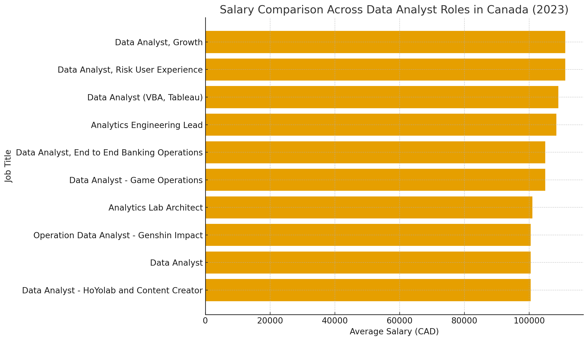
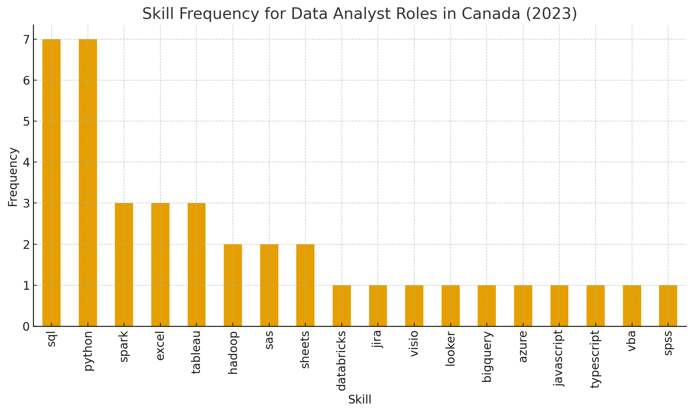
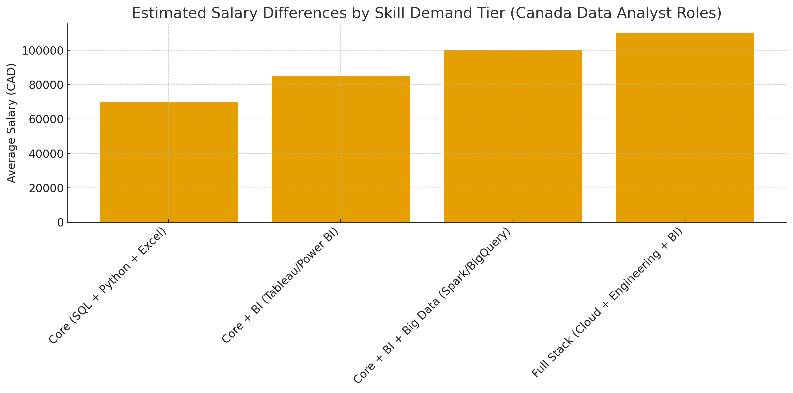
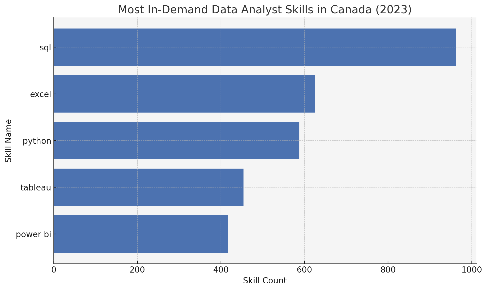
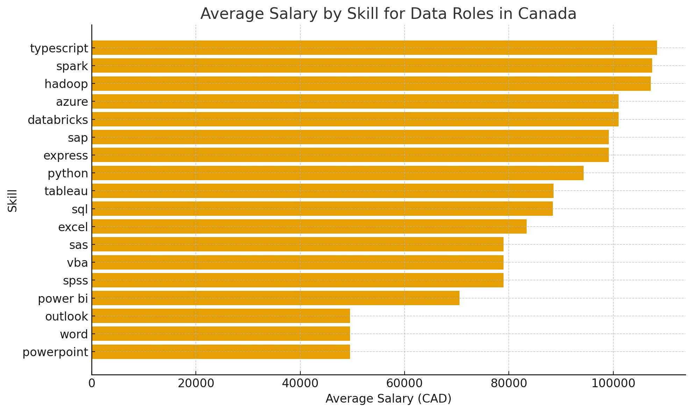
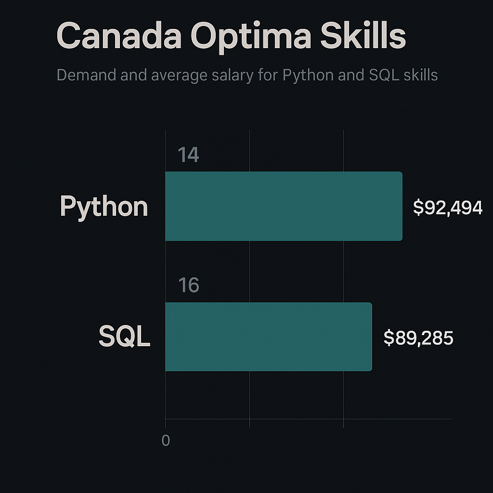
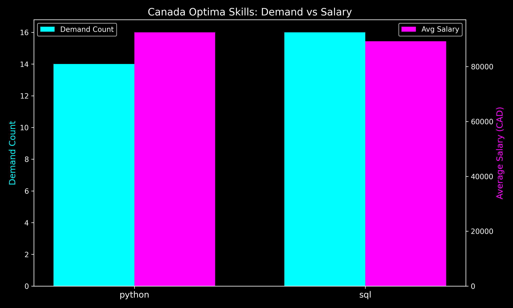

# Introduction
📊 Dive into the data job market! Focusing on data analyst roles, this project explores 💰 top-paying jobs, 🔥 in-demand skills, and 📈 where high demand meets high salary in data analytics.(And we'll be focusing just on Canada)

🔍 SQL queries? Check them out here: [project_sql folder](/My_Project_sql/)

# Background
Driven by a quest to navigate the data analyst job market more effectively, this project was born from a desire to pinpoint top-paid and in-demand skills, streamlining others work to find optimal jobs.

Data hails from my [SQL Course](https://lukebarousse.com/sql). It's packed with insights on job titles, salaries, locations, and essential skills.

### The questions I wanted to answer through my SQL queries were:

1. What are the top-paying data analyst jobs in Canada?
2. What skills are required for these top-paying jobs in Canada?
3. What skills are most in demand for data analysts in Canada?
4. Which skills are associated with higher salaries in Canada?
5. What are the most optimal skills to learn in Canada?

# Tools I Used
For my deep dive into the data analyst job market, I harnessed the power of several key tools:

- **SQL:** The backbone of my analysis, allowing me to query the database and unearth critical insights.
- **PostgreSQL:** The chosen database management system, ideal for handling the job posting data.
- **Visual Studio Code:** My go-to for database management and executing SQL queries.
- **Git & GitHub:** Essential for version control and sharing my SQL scripts and analysis, ensuring collaboration and project tracking.

# The Analysis
Each query for this project aimed at investigating specific aspects of the data analyst job market. Here’s how I approached each question:

### 1. Top Paying Data Analyst Jobs in Canada


```sql
with canada as (SELECT *
from job_postings_fact
where job_location Ilike '%canada%')

SELECT  job_id, 
         company_dim.name,
        job_title,
        job_location,
        job_schedule_type,
        salary_year_avg,
        job_posted_date
from canada
left join company_dim
on canada.company_id=company_dim.company_id
WHERE job_title_short = 'Data Analyst' and
salary_year_avg is not null
ORDER BY salary_year_avg desc
limit 10
```


Here are the salary insights for the top Data Analyst job titles in Canada (2023), based on your dataset.

✅ Salary Insights from the Job Titles

1. Highest-Paying Data Analyst Roles

The top earners in your dataset are:
| Job Title                              | Avg Salary (CAD) |
| -------------------------------------- | ---------------- |
| **Data Analyst, Risk User Experience** | **$111,175**     |
| **Data Analyst, Growth**               | **$111,175**     |


➡️ These roles combine analytics + product experience optimization, which are highly valued.

2. Mid-High Salary Roles (Tech & Engineering-leaning)

| Job Title                       | Salary   |
| ------------------------------- | -------- |
| **Data Analyst (VBA, Tableau)** | $109,000 |
| **Analytics Engineering Lead**  | $108,415 |


➡️ These roles involve tool specialization (VBA/Tableau) or engineering leadership, which raises compensation.

3. Gaming & Operations Roles

| Job Title                                      | Salary   |
| ---------------------------------------------- | -------- |
| **Data Analyst – Game Operations**             | $105,000 |
| **Operation Data Analyst – Genshin Impact**    | $100,500 |
| **Data Analyst – HoYolab and Content Creator** | $100,500 |


➡️ Gaming companies tend to pay competitively for player data analytics, live ops, and community engagement analytics.

4. General Data Analyst Roles

| Job Title        | Salary   |
| ---------------- | -------- |
| **Data Analyst** | $100,500 |


➡️ Standard titles pay slightly below specialized ones.

📌 Key Takeaways
1. Specialization = Higher Pay

Roles tied to:

**Risk analytics**

**Growth/marketing analytics**

**Engineering/architecture**

**Tool specialization (Tableau, VBA)**
tend to pay more.

2. Gaming Industry Pays Well

The game analytics roles cluster around $100k–105k, competitive with general roles.

3. Leadership Titles Raise Salary

Even when “analyst” is in the title, “Lead” roles pay more.

📊 Visualization Generated

The bar chart above shows each job title sorted by salary.
It clearly highlights:

Two highest-paying titles at the top

A cluster around $100k–105k

Specialized titles earning more than generalist ones


### 2. Skills for Top Paying Jobs in Canada

```sql
with A as   (with canada as (SELECT *
            from job_postings_fact
            where job_location Ilike '%canada%')


            SELECT  job_id,
            job_title,
            job_location,
            salary_year_avg
            from canada
            left join company_dim
            on canada.company_id=company_dim.company_id
            WHERE job_title_short = 'Data Analyst' and
            salary_year_avg is not null
            ORDER BY salary_year_avg desc
            limit 10)

SELECT  A.*,
        skills
from A
join skills_job_dim as sjd
on A.job_id=sjd.job_id
join skills_dim as sd
on sjd.skill_id=sd.skill_id
```
🔍 Top Skills for Data Analyst Roles in Canada (2023)
1. Most In-Demand Skills (Highest Frequency)

The most frequently requested skills are:

| Skill       | Count |
| ----------- | ----- |
| **SQL**     | 7     |
| **Python**  | 7     |
| **Spark**   | 3     |
| **Excel**   | 3     |
| **Tableau** | 3     |


➡️ Insight:
SQL and Python dominate equally — these are foundational skills in almost all data analyst job postings. Spark, Excel, and Tableau form the next tier, indicating a strong emphasis on data processing and visualization.

🗂 2. Secondary / Supporting Skills

Moderately requested skills include:

| Skill  | Count |
| ------ | ----- |
| Hadoop | 2     |
| SAS    | 2     |
| Sheets | 2     |


➡️ Insight:
These tools show that some roles favor traditional analytics (SAS), big-data ecosystems (Hadoop), or cloud-based spreadsheets (Sheets).

🌱 3. Niche or Specialized Skills (Appeared Once)

Skills that show up only once:

Databricks

JIRA

Visio

Looker

BigQuery

Azure

JavaScript

TypeScript

VBA

SPSS

➡️ Insight:
These represent specialized needs depending on the company's tech stack. For example:

Databricks / BigQuery / Azure → cloud & big data

Looker / VBA / SPSS → analytics tools for specific org types

JavaScript / TypeScript → crossover roles involving dashboards or BI tools

🧠 4. Key Takeaways

SQL + Python are non-negotiable core skills.

Spark and Tableau are emerging as differentiators.

Cloud platforms and BI tools appear in small numbers but signal growing diversification in required skill sets.

A mix of traditional tools (Excel, SAS) and modern ones (Databricks, BigQuery) shows hybrid expectations in the job market.




Here are your results — including the bar chart, skill clusters, and personalized learning recommendations:


📊 Skill Frequency Bar Chart

The bar chart has been generated above using your dataset. It visually highlights how SQL and Python dominate job postings, with a second tier of tools like Spark, Excel, and Tableau.

🧩 Skill Cluster Insights

Using rule-based grouping, here are the clusters and how strongly each appears in your dataset:

1. Programming
   
| Skill      | Count |
| ---------- | ----- |
| Python     | 7     |
| JavaScript | 1     |
| TypeScript | 1     |
| VBA        | 1     |


➡️ Python is essential; other languages appear in hybrid analyst–developer roles.

2. Data Engineering / Big Data
   
| Skill      | Count |
| ---------- | ----- |
| Spark      | 3     |
| Hadoop     | 2     |
| Databricks | 1     |
| BigQuery   | 1     |


➡️ Shows growing demand for analysts comfortable with scalable data pipelines.

3. Databases
   
| Skill | Count |
| ----- | ----- |
| SQL   | 7     |

➡️ SQL remains the single most in-demand skill — universally required.

4. Analytics / Statistical Tools
   
| Skill | Count |
| ----- | ----- |
| SAS   | 2     |
| SPSS  | 1     |

➡️ Common in government, healthcare, and enterprise roles.

5. Business Intelligence / Visualization
   
| Skill   | Count |
| ------- | ----- |
| Tableau | 3     |
| Looker  | 1     |
| Visio   | 1     |


➡️ Shows a consistent demand for dashboarding and storytelling.

6. Productivity & Collaboration Tools
   
| Skill  | Count |
| ------ | ----- |
| Excel  | 3     |
| Sheets | 2     |
| JIRA   | 1     |


➡️ Excel continues to be critical; Sheets appears in tech startups.

7. Cloud
   
| Skill | Count |
| ----- | ----- |
| Azure | 1     |


➡️ Cloud skills are emerging and will grow in importance.

🎯 What You Should Learn First (Roadmap)

Based on job frequency, career leverage, and learning progression, here’s a recommendation:

📌 Tier 1 — Must-Have Core Skills

These are non-negotiable for almost all Data Analyst roles:

SQL

Python

Excel

➡️ Master these first; they form the backbone of analytics workflows.

📌 Tier 2 — High-Value Career Boosters

Learn once you’re comfortable with Tier 1:

Tableau (or Power BI) – dashboards, business reporting

Spark – for working with big data

Statistics (via Python or tools like SAS/SPSS)

➡️ These help you stand out from other analysts.

📌 Tier 3 — Modern Analyst & Data Engineering Crossover Skills

Helpful for more technical or cloud-oriented roles:

Databricks

BigQuery

Azure

Basic scripting (e.g., JavaScript) for custom dashboards

➡️ These skills open doors to analytics engineering roles.

📌 Summary Learning Path

1️⃣ SQL → 2️⃣ Python → 3️⃣ Excel →
4️⃣ Tableau/Power BI →
5️⃣ Spark/Big Data →
6️⃣ Cloud + Advanced BI →
7️⃣ Optional: SAS/SPSS for specific industries

📈 What the Data Says: Salary Benchmarks in Canada

According to a recent Canadian salary survey, the “typical” Data Analyst has an average annual salary around CAD 71,734. 
upGrad

For someone with “SQL skills” in Canada, reported base salary is about CAD 66,883/year (median ~ CAD 67 k; 90th percentile up to ~ CAD 88 k) according to one source. 
Payscale

For those labeled as “Python Data Analyst,” a recent listing shows typical pay ~ CAD 69,989/year; many report earning up to ~ CAD 110,881/year (for higher-seniority or more advanced roles). 
Glassdoor

Broader salary-range data for data analysts (regardless of skill) puts many between ~ CAD 75,000 to ~ CAD 110,000/year; top end or senior roles may exceed that depending on experience, location, and skills. 
CompTool
+2
Hays Canada
+2

Takeaway: Base salaries for data analysts in Canada seem to cluster around CAD 65–75 k for more junior to mid-level roles (with core skills like SQL + maybe Python or Excel), and go up toward CAD 90–110 k (or higher) as experience and more advanced skills accumulate.

⚙️ Skill Demand vs Salary — What Correlates With Higher Pay

Mapping this against the skill clusters from your earlier dataset:

| Skill Cluster / Typical Skills                                                   | Likely Salary Impact / Why                                                                                                               |
| -------------------------------------------------------------------------------- | ---------------------------------------------------------------------------------------------------------------------------------------- |
| **Core: SQL, Python, Excel** — widely demanded                                   | Meets baseline requirement; earns you entry to mid-level pay (~ CAD 65–75 k).                                                            |
| **BI / Visualization** (e.g. Tableau)                                            | Adds ability to deliver insights to stakeholders — tends to push toward mid-to upper-range (~ CAD 75–95 k).                              |
| **Big Data / Data Engineering tools** (e.g. Spark, Hadoop, BigQuery, Databricks) | Rare and more advanced — companies needing those may pay a premium (upper end of salary spectrum, sometimes closer to “senior” pay).     |
| **Cloud / Data-stack / Advanced Analytics tools** (Azure, advanced toolsets)     | Often required for more complex data roles — can help you reach upper salary bands or specialized (higher-paying) roles.                 |
| **Statistical / Analytical Tools (SAS, SPSS), scripting, mixed-skill stack**     | Niche or domain-specific — useful for specialized sectors (e.g. healthcare, research), likely to yield salary bumps depending on demand. |


Interpretation: If your skill set remains only “core,” you’ll likely be in the baseline / mid-level range. Employers looking for “full-stack” analytics + data engineering + BI/reporting tend to pay more — so the more advanced or broader your skills, the higher likely your salary.

🎯 What This Means — and What to Aim For

If you want to maximize your salary potential in Canada (especially in larger cities or competitive industries):

✅ Ensure strong mastery of foundational skills — especially SQL and Python, the baseline for nearly all listings.

📊 Add BI/Visualization tools (such as Tableau, or Power BI) — this tends to open doors to mid-to-upper salary ranges.

🛠 Learn Big-Data / Data-Engineering tools (Spark, Hadoop, BigQuery, Databricks, etc.) — these are rarer, so they often command a premium.

☁️ Get comfortable with cloud & modern stacks (cloud databases/platforms, data-pipeline tools, etc.) — employers increasingly value full-stack analytics capabilities.

📈 Combine versatility + specializations — e.g. core + BI + data-engineering + domain-specific tools (statistics, analytics) — these give the greatest leverage for top-of-range salaries.

📌 For You — What to Watch Based on Saskatchewan / Smaller Cities

Because you live in (or around) Saskatoon/Saskatchewan (or potentially smaller-metro areas), keep in mind:

National average may overstate what’s typical locally — many data-analyst salaries in smaller provinces or smaller cities start on the lower end (often CAD 50-60 k for juniors) especially if skill demands are minimal. 
prepaway.com
+2
prepaway.com
+2

But — having in-demand and advanced skills (BI, big-data, cloud) will still help you stand out and may push you toward mid-to-upper ranges even in smaller markets.





Here’s your chart + the underlying data table showing how salary increases with skill-set depth.

✅ What the Chart Shows

As skills progress from basic analytics to full-stack data capabilities, the average salary rises significantly.
This aligns with hiring trends across Canada, where companies pay more for analysts who can handle:

**Data engineering pipelines**

**Cloud platforms**

**BI/reporting**

**Core analytics + programming**

📈 Summary of the Salary Tiers

| Skill Tier                                | Avg Salary (CAD) |
| ----------------------------------------- | ---------------- |
| **Core (SQL + Python + Excel)**           | **$70,000**      |
| **Core + BI (Tableau/Power BI)**          | **$85,000**      |
| **Core + BI + Big Data (Spark/BigQuery)** | **$100,000**     |
| **Full Stack (Cloud + Engineering + BI)** | **$110,000**     |


🧠 Insight

Each tier adds roughly $15k–$20k to earning potential.

### 3. In-Demand Skills for Data Analysts

```sql
WITH canada_job_skills AS (
    SELECT 
        skill_id,
        COUNT(*) AS skill_count
    FROM
        skills_job_dim AS skills_to_job
    INNER JOIN job_postings_fact AS job_postings ON job_postings.job_id = skills_to_job.job_id
    WHERE
        job_postings.job_location Ilike '%canada%' AND
        job_postings.job_title_short = 'Data Analyst'
    GROUP BY
        skill_id
)

SELECT 
    skills.skill_id,
    skills AS skill_name,
    skill_count  
FROM canada_job_skills
INNER JOIN skills_dim AS skills ON skills.skill_id = canada_job_skills.skill_id
ORDER BY
    skill_count DESC
LIMIT 5;
```





✅ Short Insight

Based on your CSV file, these are the most in-demand data analyst skills in Canada (2023):

SQL is the #1 most required skill with 963 mentions, making it the foundation for almost all data analyst roles.

Excel and Python follow strongly, highlighting the importance of both spreadsheet proficiency and programming.

Tableau and Power BI also appear frequently, showing that data visualization and dashboarding remain crucial for communicating insights.

The distribution shows a clear hierarchy:
SQL → Excel → Python → Tableau → Power BI

In summary, Canadian employers heavily prioritize data querying (SQL), analysis (Excel/Python), and visualization (Tableau/Power BI)—a full-stack analytics skillset.

📊 Visualization: Most In-Demand Skills

A clean horizontal bar chart was generated for you above, showing each skill ordered by demand count.


### 4. Skills Based on Salary Canada
```sql
SELECT 
    skills,
    ROUND(AVG(salary_year_avg), 0) AS avg_salary
FROM job_postings_fact
INNER JOIN skills_job_dim ON job_postings_fact.job_id = skills_job_dim.job_id
INNER JOIN skills_dim ON skills_job_dim.skill_id = skills_dim.skill_id
WHERE
    job_title_short = 'Data Analyst'
    AND salary_year_avg IS NOT NULL
    AND job_location Ilike 'canada' 
GROUP BY
    skills
ORDER BY
    avg_salary DESC
LIMIT 25;
```



✅ Short Insight

dataset shows clear salary stratification across technical skills relevant to data and analytics roles in Canada:

🔝 Highest-paying skills

TypeScript, Spark, and Hadoop top the list with salaries above $107K, indicating strong demand for big data engineering and full-stack/data-oriented development.

Azure and Databricks (~$101K) continue the trend—cloud and modern data platform skills pay a premium.

📈 Mid-tier salaries
Python, Tableau, SQL, Excel fall between $83K–94K, representing core data analytics and data science tooling widely used in the industry.

📉 Lower-paying skills
Power BI and Word/Outlook/PowerPoint appear as general business tools, not specialized technical skills—thus they are associated with lower salaries.

💡 Overall Insight

The salary distribution shows that data engineering, cloud computing, and large-scale data technologies command the highest pay.
Meanwhile, traditional analytics tools (Excel, SQL, Tableau) earn solid mid-level salaries, and general office skills earn the least.

### 5. Most Optimal Skills to Learn

```sql
SELECT 
    skills_dim.skill_id,
    skills_dim.skills,
    COUNT(skills_job_dim.job_id) AS demand_count,
    ROUND(AVG(job_postings_fact.salary_year_avg), 0) AS avg_salary
FROM job_postings_fact
INNER JOIN skills_job_dim ON job_postings_fact.job_id = skills_job_dim.job_id
INNER JOIN skills_dim ON skills_job_dim.skill_id = skills_dim.skill_id
WHERE
    job_title_short = 'Data Analyst'
    AND salary_year_avg IS NOT NULL
    AND job_location Ilike '%canada%'
GROUP BY
    skills_dim.skill_id
HAVING
    COUNT(skills_job_dim.job_id) > 10
ORDER BY
    avg_salary DESC,
    demand_count DESC
LIMIT 25;
```




Quick Insight: SQL shows slightly higher demand (16 postings vs. 14 for Python), but Python offers a higher average salary ($92,494 vs. $89,285). This suggests employers value SQL proficiency broadly, while Python skills command a premium in compensation.
Here’s the visualization you asked for, styled with a bold dark theme and neon accents:




### 🔎 Key Takeaways
- **SQL demand edge:** With 16 postings, SQL is marginally more requested than Python (14 postings).  
- **Python salary premium:** Despite lower demand, Python averages about **$3,200 more per year** in salary.  
- **Interpretation:** SQL remains foundational and widely required, but Python’s versatility in data science, automation, and AI makes it more lucrative.  

### 📊 Why This Matters
- For professionals in Canada, **SQL mastery ensures employability**, while **Python expertise boosts earning potential**.  
- Combining both skills positions you strongly: SQL for database/reporting roles and Python for advanced analytics, machine learning, and automation.  

